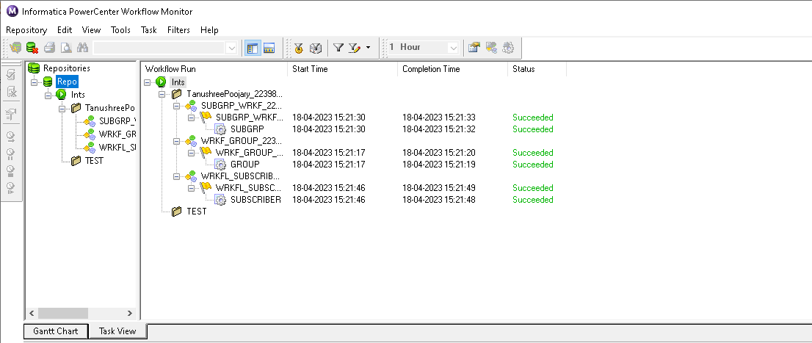
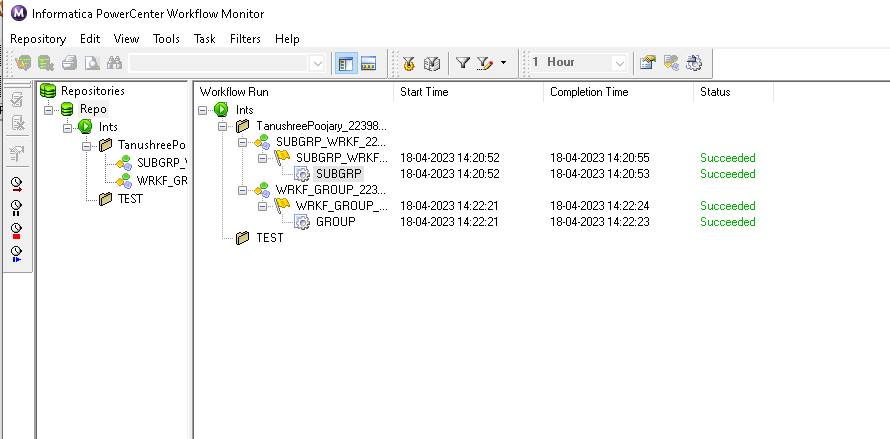

# 🏥 Healthcare Enrollment ETL Workflow – Informatica PowerCenter

This project demonstrates a complete ETL workflow for healthcare enrollment using Informatica PowerCenter. It ingests group, subgroup, and subscriber data from various flat files, applies transformations and validations, loads into Oracle staging tables, and generates XML-based welcome letters for valid subscribers.

---

## 📌 Objective

To build a healthcare data pipeline that:
- Loads group, subgroup, and subscriber files from multiple formats
- Validates foreign key integrity across entities
- Logs rejected rows (with reasons)
- Outputs validated data into XML welcome letters

---

## 🔁 ETL Process Flow

Each entity is handled in a dedicated workflow. The process ensures referential integrity at each stage before generating letters.

### 1. **Group Load**
- Source: `Group_Fixed_2239842.txt`, `Group_Comma_2239842.csv`
- Target: Oracle table `GROUP_2239842`
- Transformation: `LPAD(GROUP_ID, 8, '0')` to standardize IDs

### 2. **Subgroup Load**
- Source: `Subgrp_Tab_2239842.txt`
- Validated using a lookup on `GROUP_ID` from the group table
- Rejected rows logged in: `subgrp_join_errors_2239842_.txt`
- Target: `SUBGRP_39842`

### 3. **Subscriber Load**
- Source: `Subscriber_Comma_2239842.csv`
- Validated using a join on both `GRP_ID` and `SUBGRP_ID`
- Target: Oracle table `SUBSCRIBER_2239842`

### 4. **Welcome Letter Generation**
- Uses a 3-way join between Group, Subgroup, and Subscriber tables
- Output: XML letters stored in `LETTER_2239842.XML` and `W_Welcome_letter.XML`

---


## 🧪 Sample Output

Final XML letter files:
- `LETTER_2239842.XML`
- `W_Welcome_letter.XML`

Subgroups rejected due to invalid `GROUP_ID`:
- `subgrp_join_errors_2239842_.txt`

---

## 📋 Workflow Execution Snapshots

All sessions ran successfully. Each workflow completed in under 3–4 seconds.

### Project Monitor



### Workflow Monitor


### Subgroup Workflow Monitor



---

## ⚠️ Notes on Transformation Warnings

There were warnings during the session about `LPAD()` function operands being auto-cast to strings. These didn’t affect processing.

**Best practice fix**:
```sql
TO_CHAR(LPAD(TO_CHAR(GRP_ID), 8, '0'))
````

---

## 🛠 Tools Used

* **Informatica PowerCenter v10.5.2**
* **Oracle 12c**
* **Flat Files** (Fixed, Comma, Tab delimited)
* **XML/XSD Validation**
* **Windows OS**

---

## 👩‍💻 Author

**Tanushree Poojary**
Master’s in Information Management
University of Illinois Urbana-Champaign
📫 [tp25@illinois.edu](mailto:tp25@illinois.edu)
🔗 [LinkedIn](https://www.linkedin.com/in/tanushreep25/)

---

## 📁 License

For academic and demonstration purposes only.

